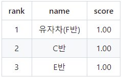
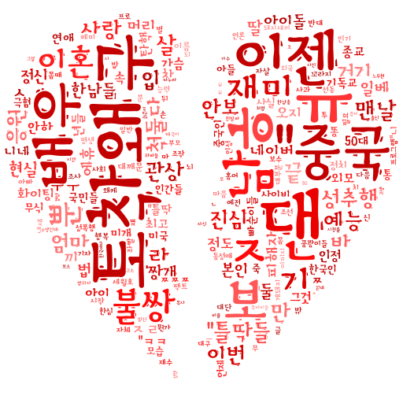

# KDT-AI 프로젝트 공모전 스터디

프로젝트 공모전 스터디의 소그룹 스터디 정보 공유 및 자료 취합을 위한 repository입니다!

Github 사용법은 수강하시는 LMS 스쿨의 Github 자료를 참고해봅시다!

### 참고글

**노션 안내페이지 바로가기** : [**링크**](https://alike-blade-14a.notion.site/0d3090d710bf49a09af1c4a20ebe4aaa)

---

<h3>
 1st Competition : Covid-19 흉부 x-ray classification 과제 

  

  

  
<h3>
 바로가기 : <a href="https://www.kaggle.com/competitions/kdtai-1/">링크</a>
</h3>

 
---

<h3>
 2nd Competition : 한국어 혐오 및 차별 텍스트 분류 과제 
</h3>

<h3>
 바로가기 : <a href="https://www.kaggle.com/competitions/kdtai-2/">링크</a>
</h3>

---

### 사용법

각 소그룹별로, 진행한 관련 자료를 해당되는 디렉토리에 직접 commit 및 push해주시면 됩니다!

임시로 **'alphabet'반** 형태로 디렉토리를 생성하였으니, 팀명을 정하신 분들은 디렉토리 이름을 바꾸어 commit해주셔도 됩니다.

---

### 올려야 할 자료

- **대그룹 컴패티션 종료 시** : 작업했던 자료 일체
  - 학습모델
  - 학습코드
  - readme 파일 (학습 방법 및 코드에 대한 설명 일체)
  
- **대그룹 스터디 진행 후** : 발표자료 일체
- **소그룹 스터디 진행 후** : 스터디 자료 일체
  - 그 날 진행했던 회의록
  - 관련 자료

---

### 주의사항

- merge과정에서의 충돌 방지를 위해, **본인의 스터디 그룹에 해당하는 하위 디렉토리**만을 push해주시기 바랍니다.

